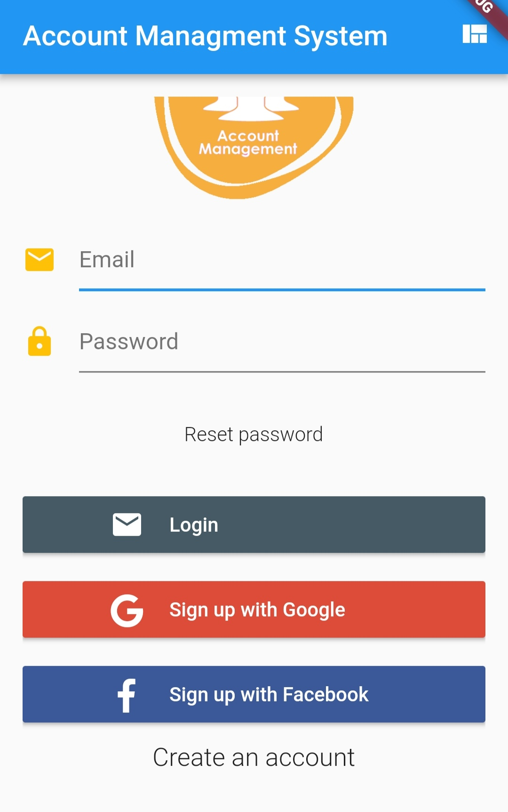
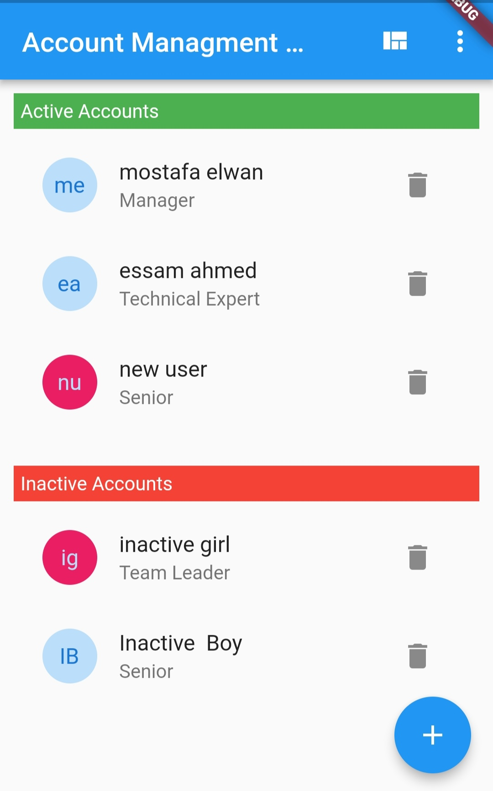
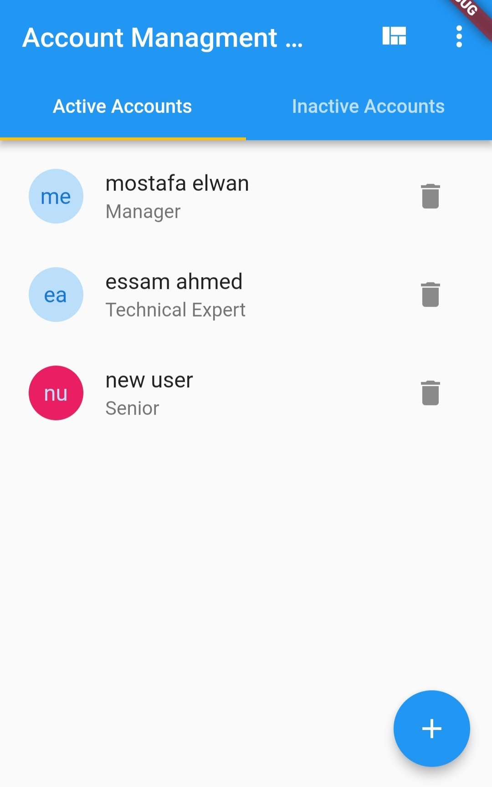
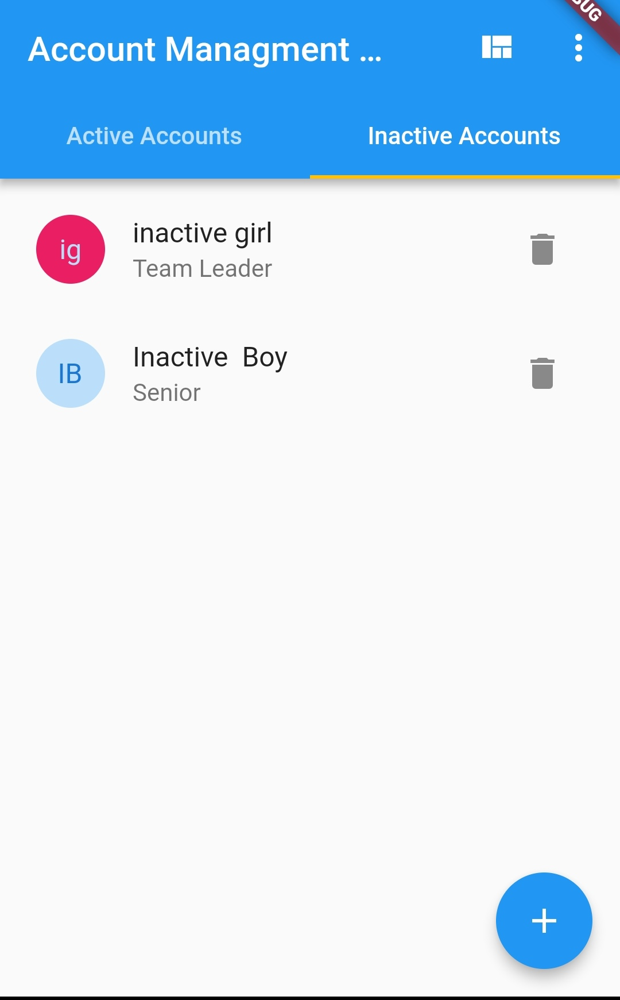
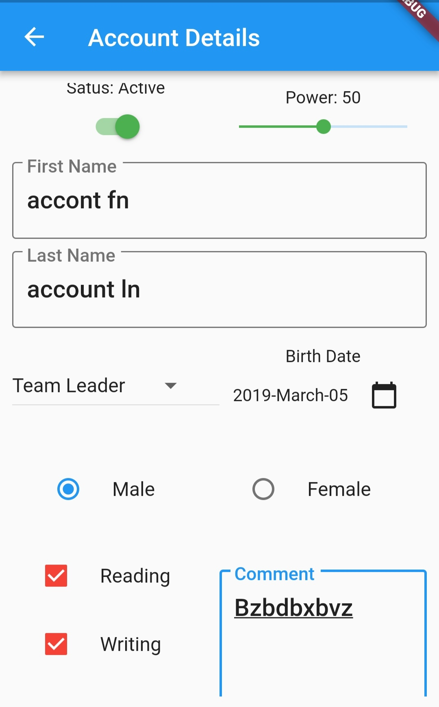
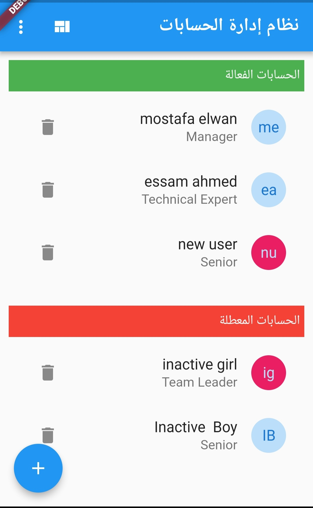
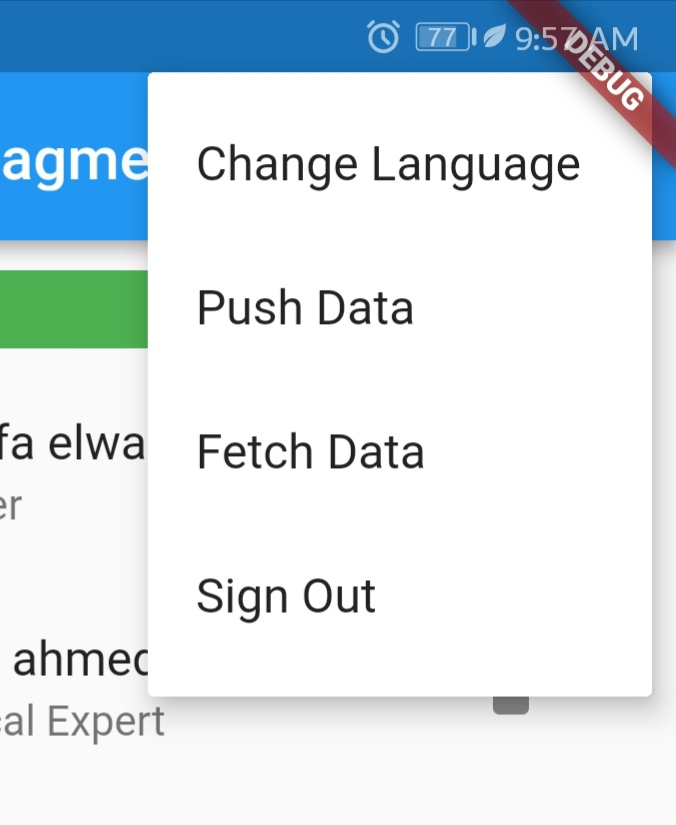

# account_managment

This is the Account Managment flutter app for Study

## Login Page

This page is fully integrated with Firebase plateform to authenticate, create or reset password.

## Home Page (as List View)

This is the home page while all accounts are retrieved from the local database and displayed in the two mentioned lists, one for active accounts and another for inactive.

## Home Page (as Tabs View)

This is another viewing for the home page while all accounts are retrieved from the local database and displayed in the two mentioned tab views, one for active accounts and another for inactive.

   

## Editor Page

From this page a new account can be added or an existing one can be updated, noting that data is being stored in local database if save button is being pressed after validating on mandatory fields.

## Home Page (Arabic loclization)

Here is the home page but after changing language.

## Home Page - Menu Options

From this menu you can change languge, push data to server, retrieve data fro server or log out.

Push data to Server: Data is being published on firestore database.
Fetch data from Server: Data is being published on firestore database.

### Getting Started

This project is a starting point for a Flutter application.

A few resources to get you started if this is your first Flutter project:

- [Lab: Write your first Flutter app](https://flutter.io/docs/get-started/codelab)
- [Cookbook: Useful Flutter samples](https://flutter.io/docs/cookbook)

For help getting started with Flutter, view our 
[online documentation](https://flutter.io/docs), which offers tutorials, 
samples, guidance on mobile development, and a full API reference.
